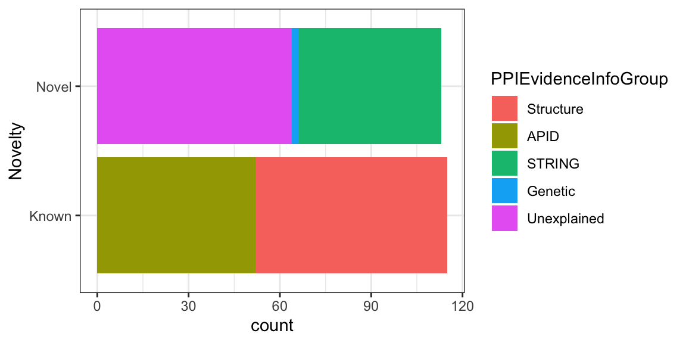
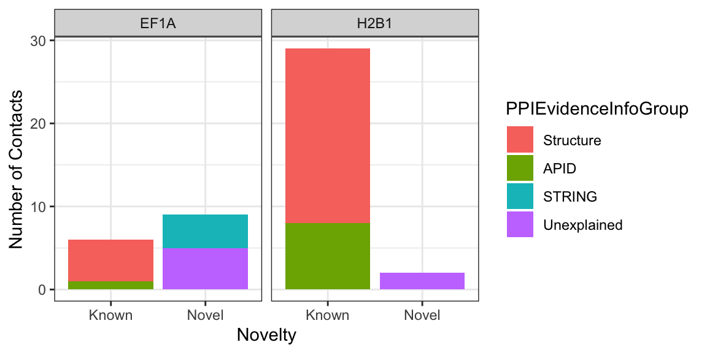

# Proteomics Data Viz

## Visualizing Proteomics data with ggplot2


Last session we worked on Cross-linking Mass Spectrometry Data. The data consisted of interaction between 300 yeast nuclear proteins. 
We also learned about concepts behind `Grammer of Graphics` and plotting using `ggplot2`. 

In this tutorial, we will be working on the data from Yeast Nuclear Protein interaction study using Cross-linking Mass Spectrometry. 


```r
library(tidyverse)
```

We continue with the Cross-linking Proteomics dataset from Cytoscape tutorial.
The data was in excel, therefore we first converted it into `Comma separated file (csv)`  format.

### Optional: Reading excel file into R {.extra}
If you want to load the excel files files directly to `R` then you can use another library `readxl`. 


```r
library(readxl)
nuclear_xl_ms_excel <- readxl::read_excel("r-intro-files/Nuclear_XL_MS.xlsx")
head(nuclear_xl_ms_excel)
```

```
## # A tibble: 6 x 8
##   Protein1 Protein2 NameProtein1 NameProtein2 PPINovelty PPIEvidenceInfo…
##   <chr>    <chr>    <chr>        <chr>        <chr>      <chr>           
## 1 P02293   P04911   H2B1         H2A1         Known      Structure       
## 2 P02293   P02309   H2B1         H4           Known      Structure       
## 3 P02994   P32471   EF1A         EF1B         Known      Structure       
## 4 P0CX51   P38011   RS16A        GBLP         Known      Structure       
## 5 P02406   P0CX49   RL28         RL18A        Novel      STRING          
## 6 P33297   P53549   PRS6A        PRS10        Known      Structure       
## # … with 2 more variables: TotalNumberOfCSMs <dbl>,
## #   NumberUniqueLysLysContacts <dbl>
```


## Exploring the data

```r
library(readxl)
nuclear_xl_ms <- read_csv("r-intro-files/Nuclear_XL_MS.csv")
head(nuclear_xl_ms)
```

```
## # A tibble: 6 x 8
##   Protein1 Protein2 NameProtein1 NameProtein2 PPINovelty PPIEvidenceInfo…
##   <chr>    <chr>    <chr>        <chr>        <chr>      <chr>           
## 1 P02293   P04911   H2B1         H2A1         Known      Structure       
## 2 P02293   P02309   H2B1         H4           Known      Structure       
## 3 P02994   P32471   EF1A         EF1B         Known      Structure       
## 4 P0CX51   P38011   RS16A        GBLP         Known      Structure       
## 5 P02406   P0CX49   RL28         RL18A        Novel      STRING          
## 6 P33297   P53549   PRS6A        PRS10        Known      Structure       
## # … with 2 more variables: TotalNumberOfCSMs <dbl>,
## #   NumberUniqueLysLysContacts <dbl>
```

Now lets examine the dataset with two base R functions `str` and `summary`


```r
str(nuclear_xl_ms)
```

```
## Classes 'spec_tbl_df', 'tbl_df', 'tbl' and 'data.frame':	228 obs. of  8 variables:
##  $ Protein1                  : chr  "P02293" "P02293" "P02994" "P0CX51" ...
##  $ Protein2                  : chr  "P04911" "P02309" "P32471" "P38011" ...
##  $ NameProtein1              : chr  "H2B1" "H2B1" "EF1A" "RS16A" ...
##  $ NameProtein2              : chr  "H2A1" "H4" "EF1B" "GBLP" ...
##  $ PPINovelty                : chr  "Known" "Known" "Known" "Known" ...
##  $ PPIEvidenceInfoGroup      : chr  "Structure" "Structure" "Structure" "Structure" ...
##  $ TotalNumberOfCSMs         : num  36 21 20 13 13 12 12 12 11 10 ...
##  $ NumberUniqueLysLysContacts: num  12 6 5 1 2 3 2 3 3 1 ...
##  - attr(*, "spec")=
##   .. cols(
##   ..   Protein1 = col_character(),
##   ..   Protein2 = col_character(),
##   ..   NameProtein1 = col_character(),
##   ..   NameProtein2 = col_character(),
##   ..   PPINovelty = col_character(),
##   ..   PPIEvidenceInfoGroup = col_character(),
##   ..   TotalNumberOfCSMs = col_double(),
##   ..   NumberUniqueLysLysContacts = col_double()
##   .. )
```

```r
summary(nuclear_xl_ms)
```

```
##    Protein1           Protein2         NameProtein1       NameProtein2      
##  Length:228         Length:228         Length:228         Length:228        
##  Class :character   Class :character   Class :character   Class :character  
##  Mode  :character   Mode  :character   Mode  :character   Mode  :character  
##                                                                             
##                                                                             
##                                                                             
##   PPINovelty        PPIEvidenceInfoGroup TotalNumberOfCSMs
##  Length:228         Length:228           Min.   : 1.000   
##  Class :character   Class :character     1st Qu.: 1.000   
##  Mode  :character   Mode  :character     Median : 1.000   
##                                          Mean   : 2.706   
##                                          3rd Qu.: 3.000   
##                                          Max.   :36.000   
##  NumberUniqueLysLysContacts
##  Min.   : 1.000            
##  1st Qu.: 1.000            
##  Median : 1.000            
##  Mean   : 1.342            
##  3rd Qu.: 1.000            
##  Max.   :12.000
```
While the data in `PPINovelty` and `PPIEvidenceInfoGroup` are characters/strings, they can also be thought of as categorical. 

We will now look into the unique values for the PPINovelty and PPIEvidenceInfoGroup columns


```r
nuclear_xl_ms$PPINovelty %>% unique()
```

```
## [1] "Known" "Novel"
```

```r
nuclear_xl_ms$PPIEvidenceInfoGroup %>% unique()
```

```
## [1] "Structure"   "STRING"      "APID"        "Unexplained" "Genetic"
```


R has a class for categorical data known as factors. We can convert these columns to factors and provide an order to those categories (levels). By default, R will order the levels of a factor alphabetically but we can override this behaviour by defining the level order.
Here we will order the Evidence based on Strength of evidence for the interaction


```r
nuclear_xl_ms <- nuclear_xl_ms %>% mutate(
  PPINovelty = factor(PPINovelty),
  PPIEvidenceInfoGroup = factor(PPIEvidenceInfoGroup, levels = c("Structure","APID", "STRING", "Genetic", "Unexplained"))
)
nuclear_xl_ms %>% str()
```

```
## Classes 'spec_tbl_df', 'tbl_df', 'tbl' and 'data.frame':	228 obs. of  8 variables:
##  $ Protein1                  : chr  "P02293" "P02293" "P02994" "P0CX51" ...
##  $ Protein2                  : chr  "P04911" "P02309" "P32471" "P38011" ...
##  $ NameProtein1              : chr  "H2B1" "H2B1" "EF1A" "RS16A" ...
##  $ NameProtein2              : chr  "H2A1" "H4" "EF1B" "GBLP" ...
##  $ PPINovelty                : Factor w/ 2 levels "Known","Novel": 1 1 1 1 2 1 2 1 1 1 ...
##  $ PPIEvidenceInfoGroup      : Factor w/ 5 levels "Structure","APID",..: 1 1 1 1 3 1 3 1 1 2 ...
##  $ TotalNumberOfCSMs         : num  36 21 20 13 13 12 12 12 11 10 ...
##  $ NumberUniqueLysLysContacts: num  12 6 5 1 2 3 2 3 3 1 ...
```

## Plotting interactions types
Firstly we will plot the number of Known and novel interactions using with `geom_bar`


```r
ggplot(nuclear_xl_ms, aes(x = PPINovelty)) + 
geom_bar() + 
        xlab("Novelty") +
  theme_classic()
```


Now, we will rotate the bars to **Y-Axis** using `position="dodge"`


```r
ggplot(nuclear_xl_ms, aes(x = PPINovelty)) + 
geom_bar(position = "dodge") + 
        xlab("Novelty") +
  theme_classic()
```



Next, step would be to create a stacked bar chart by adding **PPIEvidenceInfoGroup** data on top of each bar


```r
ggplot(nuclear_xl_ms, aes(PPINovelty)) + 
geom_bar(aes(fill=PPIEvidenceInfoGroup),
        position = "dodge") + 
        xlab("Novelty") +
  theme_bw()
```


## Individual Proteins

First we will calculate how many times a protein appeared in **NameProtein1** column using `table` function and then sorting by descending order.
Next we will use `head()` function to print first five proteins with most observation. 


```r
table(nuclear_xl_ms$NameProtein1) %>% sort(.,decreasing = TRUE) %>% head()
```

```
## 
##  H2B1  EF1A RL27A    H3  EF3A  ODP2 
##    10     7     5     4     3     3
```

We could do same thing for **NameProtein2** column as well. 


```r
table(nuclear_xl_ms$NameProtein2)  %>% sort(.,decreasing = TRUE) %>% head()
```

```
## 
##    H3  RS15 NOP56  BFR1  PRS4 RL14A 
##     6     5     4     3     3     3
```

Now we store the rows containing H2B1 and EF1A proteins in **NameProtein1** column in a datafame.


```r
two_protein_df<- nuclear_xl_ms %>% filter(NameProtein1 %in% c("H2B1","EF1A"))

ggplot(two_protein_df, aes(x=PPINovelty, y=NumberUniqueLysLysContacts)) +
  geom_col(aes(fill=PPIEvidenceInfoGroup)) +
  labs(x= "Novelty",
  y= "Number of Contacts") +
  facet_wrap(~NameProtein1)+
  theme_classic()
```




