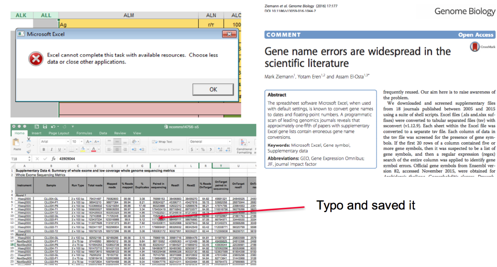
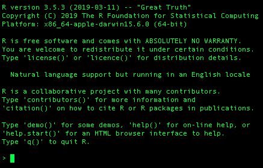
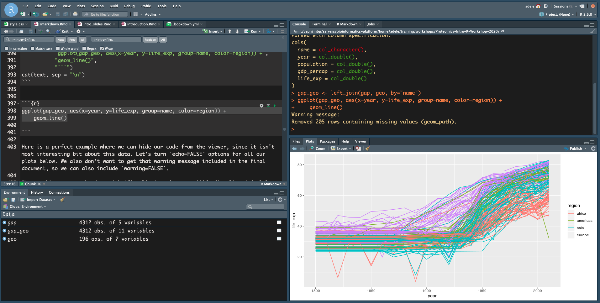

class: bg-main1 split-30 hide-slide-number
count: false

```{r xaringan-themer, eval=FALSE, include = FALSE}
library(xaringanthemer)
mono_accent_inverse(base_color = "#0086b3")
```

```{r setup, include=FALSE}
options(htmltools.dir.version = FALSE)
```

.column.bg-main3[
]
.column.slide-in-right[
.sliderbox.bg-main2.vmiddle[
.font4[Welcome]
]]

---

# Workshop Objective(s)

Aka - what we hope you get out the workshops:

* Introduction to R
* R basics: different classes
* How to plot in R
* How to find more information for a specific task in R
* Entry into more advanced & specialised uses for R in your research

---

# What is R & Why Should You Use It?

Programming language for statistical computing and graphics

* Has lots of plotting functionality and well geared towards data analysis out of box with in-built statistical tests

* [Well developed ecosystem](https://www.rstudio.com/products/rpackages/) of software packages that further expands base R for analysis, project management, visualisation, document generation, collaboration, etc

* Continous active development & thorough documentation

* Reproducible analysis

* Low risk of inadvertent data loss/mutation

* Collaborative

```{r, echo = FALSE}
anicon::nia("FREE!", animate = "pulse", color = "#0086b3")
```

---
class: center



---

class: bg-main1 split-30 hide-slide-number
count: false

.column.bg-main3[
]
.column.slide-in-right[
.sliderbox.bg-main2.vmiddle[
.font4[How To Get R]
]]

---

class: split-two white with-border border-blue

.column.bg-main1[.content[
  # CRAN 
  
  Comprehensive R Archive Network
  
  Distributes R on all platforms & maintains a large number of R packages
].row.vtop.center[
  
  ]
]
.column.bg-main2[.content[
  # Bioconductor
  
  Specific repository for bioinformatics packages & tools written for R
  
  Also contains references and annotations R objects for most model organisms
  
  ].row.vtop.center[
  
  ] 
]

---

class: split-three with-border border-blue

.row[.content[
  ### R
  * Programming language
  * Can use without RStudio
  * Free to use
]].row[.content[
  ### R-Studio
  * GUI to R (point & click interface)
  * Has limited support for other programming languages e.g python, bash, SQL, C+++
  * Can be installed locally or hosted on a server
  * Free to use/paid version with more features
]].row[.content[
  ### R-Studio Cloud
  
  * Free R-Studio access with an email account
  * Shareable workspaces - limited number of workspaces for free account
  * Unlimited number of projects in personal workspace
]]

---

### R
  
.fig80[]

Type code directly into a console

---

### R-Studio
  
.fig80[]

Contains a text editor, console, plot viewer, etc

---

class: bg-main1 split-30 hide-slide-number
count: false

.column.bg-main3[
]
.column.slide-in-right[
.sliderbox.bg-main2.vmiddle[
.font4[Workshop Setup]
]]
---

## Today (& Tomorrow)

* R basic class types
* Manipulating data-frames
* Plotting & summarising data
* Rmarkdown & document generation
* Plotting cytoscape material

---

Workshop material:

* Workshop link:
## www.linktoworkshop.com
* R Studio Cloud:
## https://rstudio.cloud/

---

class: split-two 

.row[
.split-two[
.column.bg-red[.content[
  Use a red sticky note:
  * If you need any help
  * If you don't know what you should be doing
  * If your code doesn't work and you don't know why
  
  (Seriously, don't hesitate to ask for help)
  ]]
.column.bg-green[.content[
  Use a green sticky note:
  * If you don't need help
  * If you have completed a challenge
  * If you're doing fine
  ]]
  
]]

.row[.content[

  ### Challenge: Are you ready for the workshop?
  
  1. Do you have a link to the workshop material?
  2. Are you logged in to R-Studio Cloud?
  3. Do you have a link to the Etherpad?
  
  Raise the appropriate sticky note for your situation.
]]

