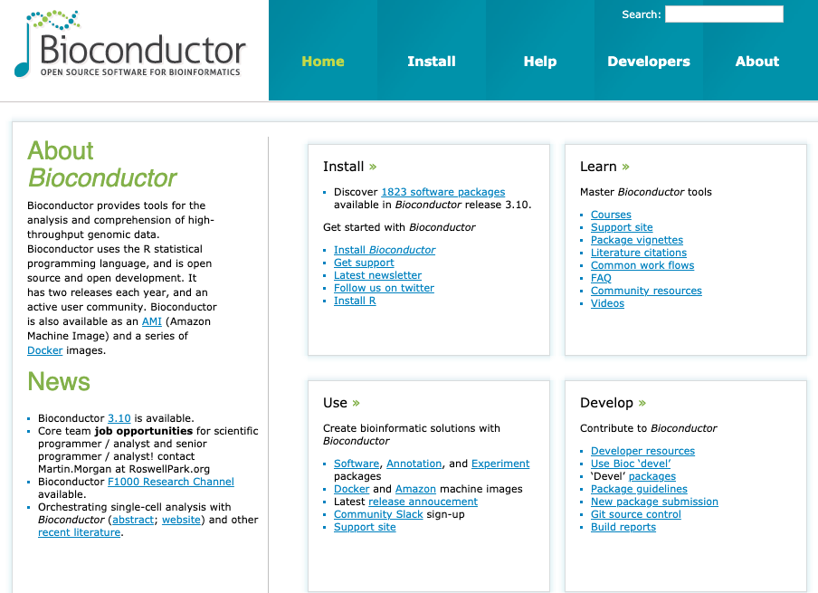

background-image: url("images/Rlogo.svg")
background-position: 30% 30%
class: center, middle

```{r xaringan-themer, eval=FALSE, include = FALSE}
library(xaringanthemer)
mono_accent_inverse(base_color = "#0086b3")
```

```{r setup, include=FALSE}
options(htmltools.dir.version = FALSE)
```


---
# Welcome

This workshop over today & tomorrow:

* R basic class types
* Manipulating data-frames
* Plotting & summarising data
* Rmarkdown & document generation
* Plotting cytoscape material

```{r, fig.align="center", echo = FALSE, out.height="30%"}
knitr::include_graphics("images/progression.png")
```

---

# Why use R

Programming language for statistical computing and graphics

Has lots of plotting functionality and well geared towards data analysis out of box with in-built statistical tests

[Well developed ecosystem](https://www.rstudio.com/products/rpackages/) of software packages that further expands base R for analysis, project management, visualisation, document generation, collaboration, etc

Continous active development & thorough documentation

```{r, fig.align="center", echo = FALSE,  out.height="90%",  eval=FALSE}
knitr::include_graphics("images/free.png")
```

```{r, echo = FALSE}
anicon::nia("FREE!", animate = "pulse", color = "#0086b3")
```


---

Slide break

---

class: bg-main1 split-30 hide-slide-number

.column.bg-main3[
]
.column.slide-in-right[
.sliderbox.bg-main2.vmiddle[
.font4[How To Get R]
]]

---

class: split-two white with-border border-blue

.column.bg-main1[.content[
  # CRAN 
  
  Comprehensive R Archive Network
  
  Distributes R on all platforms & maintains a large number of R packages
].row.vtop.center[
  
  ]
]
.column.bg-main2[.content[
  # Bioconductor
  
  Specific repository for bioinformatics packages & tools written for R
  Also contains references and annotations R objects for most model organisms
  
  ].row.vtop.center[
  
  ] 
]

---

---

class: split-three white with-border border-white

.row[.content[
  ### R
  * Programming language
  * Can use without RStudio
  * Type code directly into a console
  * Free to use
]].row[.content[
  ### R-Studio
  * GUI to R (point & click interface)
  * Contains a text editor, console, plot viewer, etc
  * Has limited support for other programming languages e.g python, bash, SQL, C+++
  * Can be installed locally or hosted on a server
  * Free to use/paid version with more features
]].row[.content[
  ### R-Studio Cloud
  
  * Free R-Studio access with an email account
  * Shareable workspaces - limited number of workspaces for free account
  * Unlimited number of projects in personal workspace
]]

---

class: split-two 

.column.bg-main2[.content[

.row.vmiddle.bg-red[.content[
  Use a red sticky note:
  * If you need help
  * If your code doesn't work
  ]]

]]
.column.bg-main3[.content[

  .row.vmiddle.bg-green[.content[  
  Use a green sticky note:
  * If you don't need help
  * If you have completed a challenge
  ]]
  
]]


