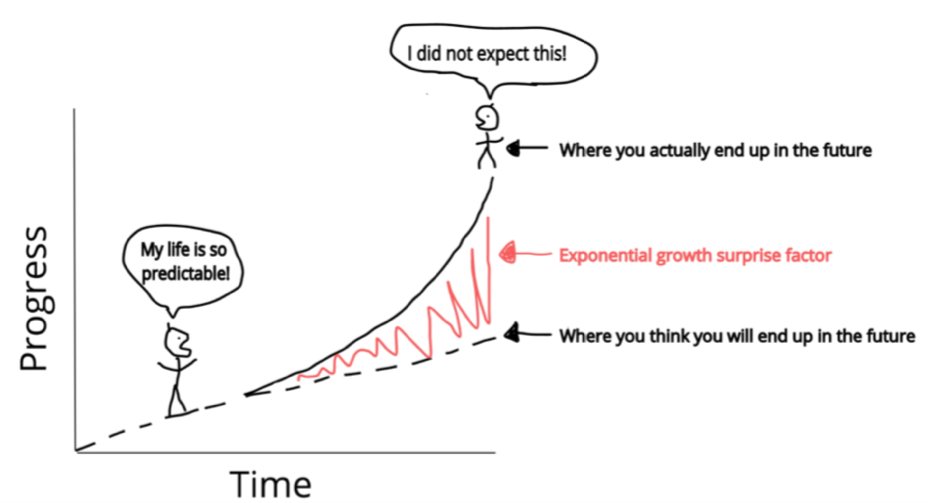

background-image: url("images/Rlogo.svg")
background-position: 30% 30%
class: center, middle

```{r xaringan-themer, include = FALSE}
library(xaringanthemer)
mono_accent_inverse(base_color = "#0086b3")
```

```{r setup, include=FALSE}
options(htmltools.dir.version = FALSE)
```


---
# Welcome

This workshop:

* R basic class types
* Manipulating data-frames
* Plotting & summarising data
* Entry into more advanced & specialised uses of R for your research

```{r, fig.align="center", echo = FALSE, out.height="40%"}

```

---

# Why use R

Programming language for statistical computing and graphics

Has lots of plotting functionality and well geared towards data analysis out of box with in-built statistical tests

[Well developed ecosystem](https://www.rstudio.com/products/rpackages/) of software packages that further expands base R for analysis, project management, visualisation, document generation, collaboration, etc

Continous active development & thorough documentation

```{r, fig.align="center", echo = FALSE,  out.height="90%",  eval=FALSE}
knitr::include_graphics("images/free.png")
```

```{r, echo = FALSE}
anicon::nia("FREE!", animate = "pulse", color = "#0086b3")
```


---

Slide break

---

class: bg-main1 split-30 hide-slide-number

.column.bg-main3[
]
.column.slide-in-right[
.sliderbox.bg-main2.vmiddle[
.font4[How To Get R]
]]

---

class: split-two white with-border border-blue

.column.bg-main1[.content[
  # CRAN 
  Comprehensive R Archive Network
  
  Distributes R on all platforms & maintains a large number of R packages
].row.vtop.center[
  
  ]
]
.column.bg-main2[.content[
  # Bioconductor
  Source for most bioinformatics tools & libraries for R
  ].row.vtop.center[
  
  ] 
]

---

class: split-two white

.row.bg-main1[.content[
I need help please
]
.row.bg-main2[.content[
I am all good/I have completed the challenge
]
